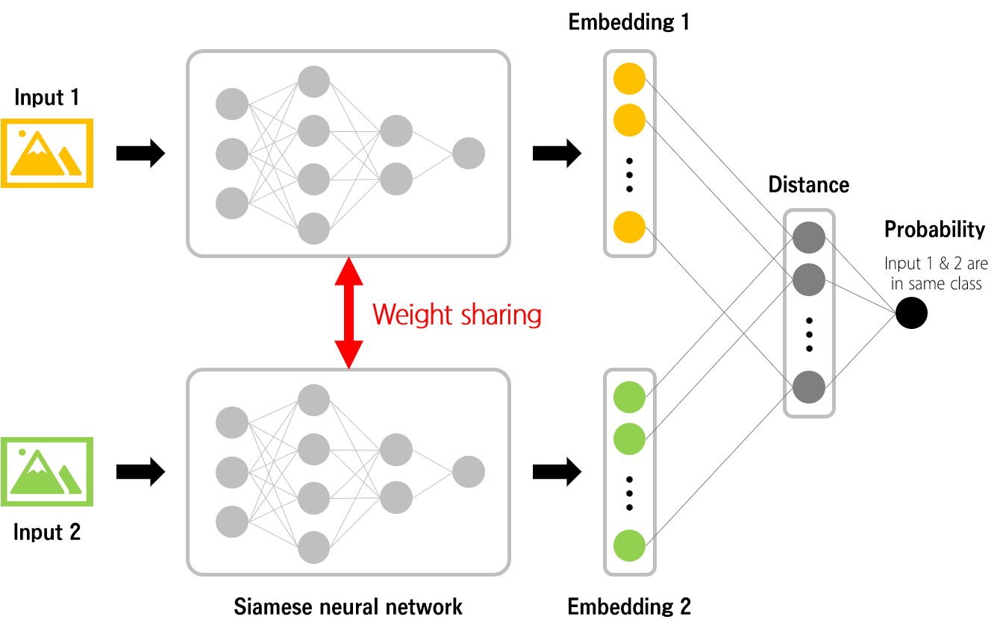
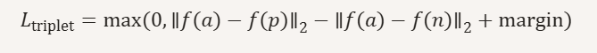
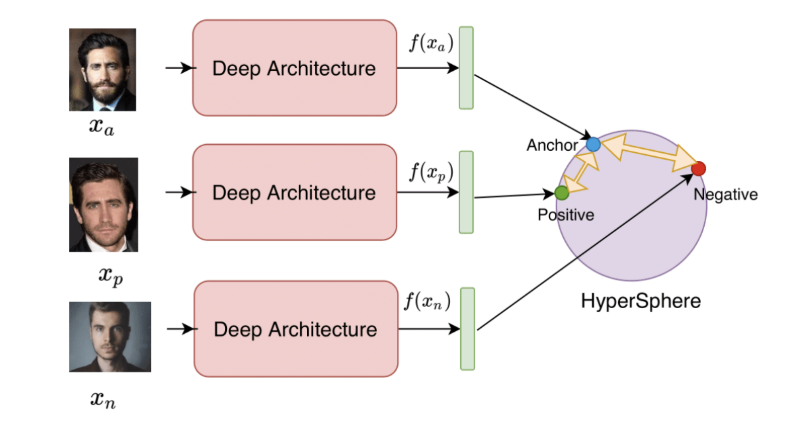
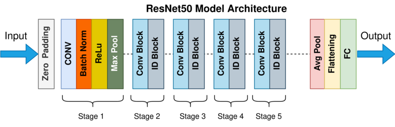
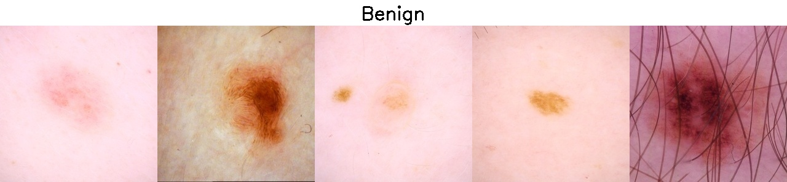
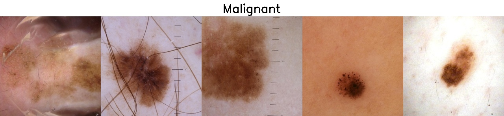
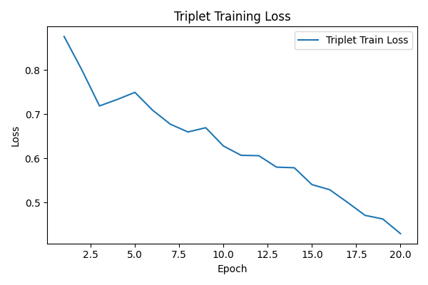
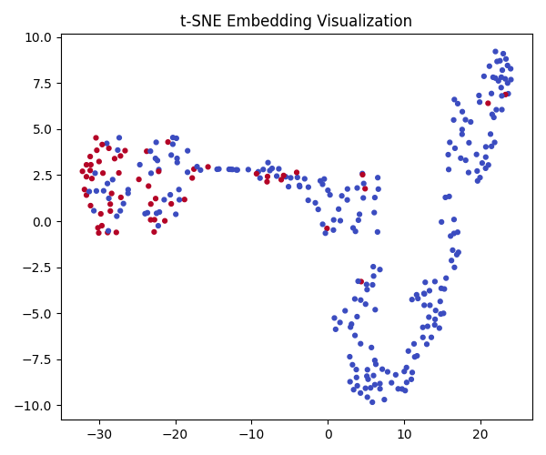
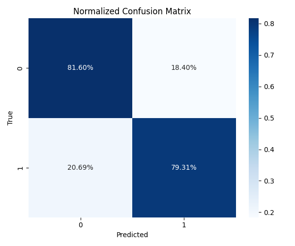
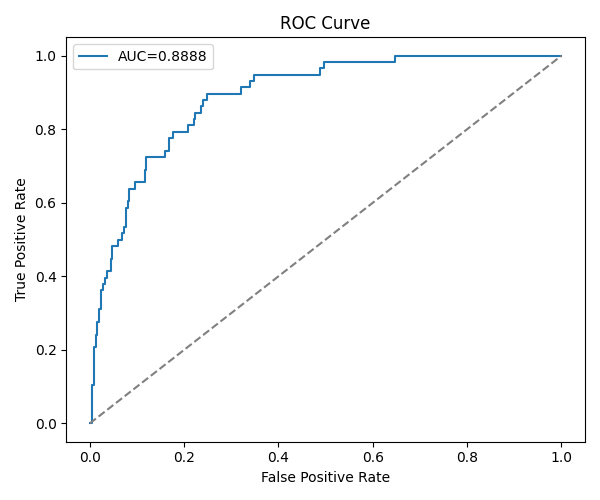

# Siamese network for Classification of ISIC 2020 Data Set
## Project Introduction
### Project Summary and Aim

The objective of this project is to develop a two-stage classifier based on a Siamese network architecture to perform binary classification on the ISIC 2020 Kaggle Challenge dataset, distinguishing between normal and melanoma skin lesions.

The final model should achieve approximately 0.80 accuracy on the test set, demonstrating strong generalization performance on unseen dermoscopic images.

## File Structure
### Current Structure
Initial Layout
```
PatternAnalysis-2025/recognition/siamese_s49128145/
│
├── image/
│   ├── image_1.jpg
│   ├── image_2.jpg
│   └── ...
│
├── dataset.py
├── modules.py
├── predict.py
├── train.py
└── README.md
```

- `dataset.py` Loads and preprocesses ISIC 2020 data. Includes triplet sampling and balanced train/val/test splits.
- `modules.py` Contains model definitions: TripletNetwork (ResNet50-based) and BinaryClassifier (fully connected).
- `train.py` Trains both models sequentially. Saves best checkpoints and plots training loss.
- `predict.py` Loads trained models and runs inference on test data. Outputs accuracy, AUC, confusion matrix, ROC curve, and t-SNE visualization.


### After Data Imports
After the data is downloaded the folders should look like this.
```
PatternAnalysis-2025/recognition/siamese_s49128145/
│
├── image/
│   ├── image_1.jpg
│   ├── image_2.jpg
│   └── ...
│
├── dataset.py
├── modules.py
├── predict.py
├── train.py
├── README.md
│
└── data/
    ├── train-metadata.csv
    └── train-image/image/
        ├── ISIC_0068279.jpg
        ├── ISIC_0077472.jpg
        └── ...
```

## The Models
### Siamese Network Basics
A Siamese Network is a neural architecture designed to learn similarity between inputs. It consists of identical subnetworks that share weights and are trained to produce similar outputs for similar inputs. In image classification tasks, Siamese networks are particularly useful for learning embeddings that capture visual similarity, making them ideal for few-shot learning, verification, and metric-based classification.



### Triplet Loss Basics
Triplet Loss is a metric learning objective that encourages the network to map images into an embedding space where:
The anchor and positive (same class) are close together
The anchor and negative (different class) are far apart

Formally, the loss is defined as:



Where:
- 𝑓(𝑥) is the embedding of image 𝑥
- 𝑎, 𝑝 and 𝑛 are the anchor, positive, and negative samples
- The margin is a hyperparameter that defines the minimum desired separation

This loss function helps the model learn a discriminative feature space that improves downstream classification.



### Implementing the Siamese Network
The core objective of the Siamese (Triplet) network is to train the Triplet Network to learn compact and discriminative embeddings that effectively represent the visual similarity between benign and malignant skin lesion images. In each training batch, the input consists of three images: an anchor, a positive sample, and a negative sample. The positive sample belongs to the same class as the anchor, while the negative sample comes from the opposite class. This triplet structure encourages the model to pull similar images closer together in the embedding space and push dissimilar ones farther apart, thereby achieving more discriminative feature representations.

A pre-trained ResNet50 model was used as the feature extraction backbone. The final fully connected classification layer was removed, leaving the convolutional layers to output 2048-dimensional feature vectors. These features were then passed through a custom projection head with fully connected layers that reduced the dimension from 2048 → 512 → 128. The final 128-dimensional embeddings were L2-normalised, ensuring that the model compared features based on cosine-like distance rather than magnitude.



The training used the standard Triplet Loss, where the margin was set to 1.0. This loss encourages the anchor-positive distance to be smaller than the anchor-negative distance by at least the margin.

The Adam optimiser was used with a learning rate of 0.0001, and a ReduceLROnPlateau scheduler was applied to reduce the learning rate when the loss plateaued. This helped stabilise convergence and prevent oscillations in the later epochs. The model was trained for 20 epochs, after which the loss began to flatten, suggesting that the embeddings had largely converged. The model with the lowest training loss was saved for later use.

After training, the Triplet Network produced meaningful embeddings that were later used as inputs to a binary classifier. These embeddings effectively captured the semantic similarity between samples and helped improve downstream classification accuracy.

### Implementing the Binary Classifier
A fully connected binary classifier was implemented on top of the embeddings produced by the Triplet Network. The classifier maps the 128-dimensional embeddings to two logits using a stack of fully connected layers: 128 → 2048 → 512 → 256 → 2, with ReLU activations after each hidden layer. The two outputs correspond to the model’s score for the benign class and the malignant class respectively; during inference argmax is used to select the more likely class.

Training the classifier uses CrossEntropyLoss. In the pipeline the Triplet Network is first used to produce and collect embeddings for the training and validation sets (via forward_once), and then its parameters are frozen (requires_grad = False) so that only the classifier’s weights are updated. This ensures the classifier learns to interpret the fixed embedding space rather than altering it.

In this experiment, the classifier was not trained over multiple epochs. Instead, the implementation performed a single pass over the collected training embeddings (i.e., one loop through the feature batches) to observe training behavior, validate the end-to-end pipeline, and prevent overfitting. During this single training pass, the optimizer (Adam, with learning rate from get_config) updated the classifier weights batch by batch. Afterwards, a single validation pass was executed to compute the loss and performance metrics.

## The Dataset
For this project, the preprocessed ISIC 2020 dataset was used (Kaggle Source
). The dataset contains dermoscopic images resized to 256×256 pixels, making it easier to handle computationally and ensuring consistent input dimensions across all samples.
The following are sample examples:





The dataset was highly imbalanced, containing two classes — 32,543 benign samples and 585 malignant ones. To mitigate this imbalance, the data loader performed class-balanced sampling, ensuring a 1:1 ratio between benign and malignant samples within each split. This prevented the model from becoming biased toward the majority class.

A range of data augmentations was applied to improve generalisation and simulate real-world variability. 

These augmentations were chosen because they simulate the differences in camera angle, lighting, and positioning commonly seen in skin lesion photography. Colour-related augmentations were avoided since colour plays an important role in distinguishing lesion types.

For data splitting, 80% of the dataset was used for training, 10% for validation, and 10% for testing. This ratio provided enough data for model learning while maintaining sufficiently large validation and test sets for consistent evaluation.

## Results
### Siamese Network Results
**Loss Plot** 



Before oversampling: class_0 = 2000, class_1 = 467
After oversampling: class_0 = 2000, class_1 = 2000
[17:22:38] Epoch  1/20 | Train Loss: 0.8758
Saved model with lowest loss: 0.8758
[17:40:35] Epoch  2/20 | Train Loss: 0.8004
Saved model with lowest loss: 0.8004
[17:58:31] Epoch  3/20 | Train Loss: 0.7185
Saved model with lowest loss: 0.7185
[18:16:28] Epoch  4/20 | Train Loss: 0.7331
[18:34:25] Epoch  5/20 | Train Loss: 0.7493
[18:52:21] Epoch  6/20 | Train Loss: 0.7088
Saved model with lowest loss: 0.7088
[19:10:19] Epoch  7/20 | Train Loss: 0.6772
Saved model with lowest loss: 0.6772
[19:28:16] Epoch  8/20 | Train Loss: 0.6595
Saved model with lowest loss: 0.6595
[19:46:13] Epoch  9/20 | Train Loss: 0.6692
[20:04:10] Epoch 10/20 | Train Loss: 0.6278
Saved model with lowest loss: 0.6278
[20:22:08] Epoch 11/20 | Train Loss: 0.6066
Saved model with lowest loss: 0.6066
[20:58:03] Epoch 13/20 | Train Loss: 0.5798
Saved model with lowest loss: 0.5798
[21:16:00] Epoch 14/20 | Train Loss: 0.5786
Saved model with lowest loss: 0.5786
[21:33:57] Epoch 15/20 | Train Loss: 0.5404
[21:51:54] Epoch 16/20 | Train Loss: 0.5288
Saved model with lowest loss: 0.5288
[22:09:51] Epoch 17/20 | Train Loss: 0.5003
Saved model with lowest loss: 0.5003
[22:27:48] Epoch 18/20 | Train Loss: 0.4707
Saved model with lowest loss: 0.4707
[22:45:46] Epoch 19/20 | Train Loss: 0.4625
Saved model with lowest loss: 0.4625
[23:03:45] Epoch 20/20 | Train Loss: 0.4293
Saved model with lowest loss: 0.4293
Loaded best Triplet model.

**t-SNE Scatterplot** 



### Binary Classifier Results
Train Loss: 0.3777 Acc: 0.8893 AUC: 0.9283 | Val Loss: 0.6276 Acc: 0.7152 AUC: 0.8449
Saved classifier (AUC=0.8449)

**Confusion Matrix/ Accuracy of Prediction** 



**ROC AUC** 



### Reproducability of Results
Across multiple independent training runs, the Siamese network demonstrated high stability. The resulting loss curves and t-SNE visualizations were consistently similar in shape, indicating strong consistency in how the model learns the embedding space.

Since the classifier was trained for only one epoch, its performance remained highly stable. The four key metrics—accuracy, AUC, sensitivity, and specificity—all hovered around the 80% mark, meeting the expected classification target. This suggests that the model generalizes well in distinguishing benign from malignant skin lesions. Nonetheless, there is room for further improvement, particularly in enhancing the classifier’s robustness.

## Usage
Before running any scripts, please ensure that the paths defined in get_config() are correctly set or modified as needed. These include:

- metadata_path: Path to the metadata CSV file (see The Dataset)
- image_dir: Directory containing the dermoscopic images
- batch_size, embedding_dims, learning_rate, and epochs: Core hyperparameters for training

You may also adjust data_subset to limit the number of samples used (set to None to use the full dataset)
Also, make sure all required packages listed in Dependencies are installed.

To train the Triplet Network and Binary Classifier, run:
```
python train.py
```

This will:
- Train the Triplet Network using triplet loss
- Save the best-performing embedding model to triplet_model.pt
- Extract embeddings and train the Binary Classifier
- Save the classifier to binary_classifier_model.pt
- Plot the triplet loss curve to triplet_train_loss.png

During training, you’ll see logs like:


```
Before oversampling: class_0 = 2000, class_1 = 467
After oversampling: class_0 = 2000, class_1 = 2000
[17:22:38] Epoch  1/20 | Train Loss: 0.8758
Saved model with lowest loss: 0.8758
[17:40:35] Epoch  2/20 | Train Loss: 0.8004
Saved model with lowest loss: 0.8004
[17:58:31] Epoch  3/20 | Train Loss: 0.7185
Saved model with lowest loss: 0.7185
⋮
[22:27:48] Epoch 18/20 | Train Loss: 0.4707
Saved model with lowest loss: 0.4707
[22:45:46] Epoch 19/20 | Train Loss: 0.4625
Saved model with lowest loss: 0.4625
[23:03:45] Epoch 20/20 | Train Loss: 0.4293
Saved model with lowest loss: 0.4293
Loaded best Triplet model.
Train Loss: 0.3777 Acc: 0.8893 AUC: 0.9283 | Val Loss: 0.6276 Acc: 0.7152 AUC: 0.8449
Saved classifier (AUC=0.8449)
```
Note that it only shows full print reporting the siamese network's training as it is a lot longer to train.

To evaluate the trained models on the test set and generate visualizations, run:
```
python predict.py
```
This will:
- Load triplet_model.pt and binary_classifier_model.pt
- Run predictions on the test set
- Print final accuracy, AUC, sensitivity, and specificity
- Save the following plots:
    - predict_confusion_matrix.png
    - predict_roc_curve.png
    - predict_tsne.png

During predicting, you’ll see logs like:
```
Loaded pretrained Triplet and Binary Classifier models.
Before oversampling: class_0 = 2000, class_1 = 467
After oversampling: class_0 = 2000, class_1 = 2000
Accuracy: 0.8117, AUC: 0.8888, Sensitivity: 0.793, Specificity: 0.816
Final Test Accuracy: 0.8117, AUC: 0.8888
```

### Python and Package Setup
1. Install Python 3.13.5
    - You can download and install Python 3.13.5 from the official website:
    https://www.python.org/downloads/release/python-3135/

2. Once Python is installed, install the required packages using pip:
    ```
    pip install matplotlib==3.10.5 numpy==2.2.6 pandas==2.3.3 scikit-learn==1.7.1 seaborn==0.13.2
    pip install torch==2.8.0+cu126 torchvision==0.23.0+cpu
    pip install opencv-python==4.12.0
    ```
The environment should be setup with the follow versions:
- Python version: 3.13.5
- torch: 2.8.0+cu126
- torchvision: 0.23.0+cpu
- numpy: 2.2.6
- pandas: 2.3.3
- opencv-python (cv2): 4.12.0
- scikit-learn: 1.7.1
- matplotlib: 3.10.5
- seaborn: 0.13.2

## Future Recommendations
While the current two-stage Siamese-based pipeline achieves stable and promising results, several improvements could further enhance performance and robustness:
- Data Augmentation & Class Balancing: Due to the severe class imbalance in the ISIC 2020 dataset, it is recommended to adopt more advanced augmentation techniques—such as MixUp, CutMix, or GAN-based image synthesis—to improve the representation of minority classes and enhance the model’s generalization ability.
- Hard Negative Mining: Introducing online or semi-hard negative mining during Triplet Network training can help the model focus on more challenging samples, leading to more discriminative and robust embeddings.
- End-to-End Joint Training: It is worth exploring joint optimization of the embedding model and the classifier, rather than freezing the Triplet Network. This end-to-end training approach may result in feature representations that are better aligned with the classification task and improve overall performance.

## References
https://www.kaggle.com/datasets/nischaydnk/isic-2020-jpg-256x256-resized/data 
https://wikidocs.net/150813       
https://pyimagesearch.com/2023/03/06/triplet-loss-with-keras-and-tensorflow/
https://medium.com/@nitishkundu1993/exploring-resnet50-an-in-depth-look-at-the-model-architecture-and-code-implementation-d8d8fa67e46f
https://github.com/shakes76/PatternAnalysis-2024/pull/63
https://github.com/shakes76/PatternAnalysis-2024/pull/92
https://github.com/shakes76/PatternAnalysis-2024/pull/123
https://github.com/shakes76/PatternAnalysis-2024/pull/61 
